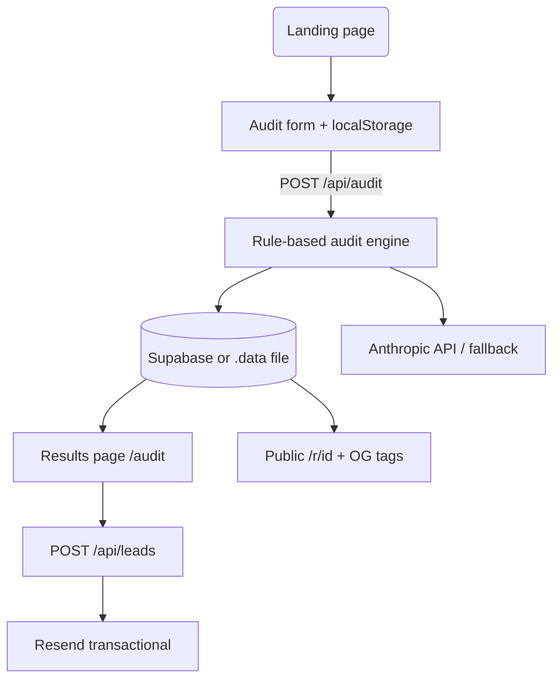

# ARCHITECTURE.md

## System diagram

## Data flow

1. User fills form (tools, plans, spend, seats, team size, use case).
2. Form state persists in `localStorage` (`ai-spend-audit-form-v1`).
3. `POST /api/audit` validates with Zod, runs `runAudit()` from `src/audit/engine.ts`.
4. Audit result + AI summary saved with `nanoid` ID.
5. User redirected to `/audit?id=…` — results rendered client-side from API.
6. Optional: email capture → honeypot check → rate limit → Supabase/file store → Resend email.
7. Public share at `/r/[id]` — PII stripped, OG metadata from savings numbers.

## Stack choice

| Layer | Choice | Why |
|-------|--------|-----|
| Framework | Next.js 15 + TypeScript | SSR for viral share URLs, API routes, Vercel deploy |
| Styling | Tailwind CSS 4 | Fast iteration, no template UI |
| Storage | Supabase (prod) / JSON file (dev) | Real backend requirement, zero-config local dev |
| Email | Resend | Free tier, simple API |
| AI summary | Anthropic Messages API | Assignment preference; fallback template when unavailable |
| Validation | Zod | Shared client/server input safety |

## Scale to 10k audits/day

- Move audit storage to Supabase Postgres with connection pooling (PgBouncer).
- Add Redis/Upstash rate limiting instead of in-memory Map.
- Queue summary generation (Inngest/ BullMQ) — don't block audit POST on LLM latency.
- CDN-cache public `/r/[id]` pages; invalidate on lead capture only if needed.
- Precompute OG images at audit time, store in R2/S3.
- Separate audit engine as npm package; horizontal scale stateless API workers.

## Abuse protection

- IP rate limit: 10 req/min on `/api/audit` and `/api/leads`
- Honeypot field `website` on lead form — silent reject if filled
- Documented in README Decisions — hCaptcha optional upgrade for production
